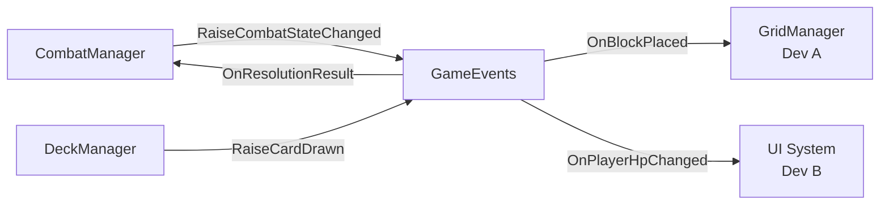
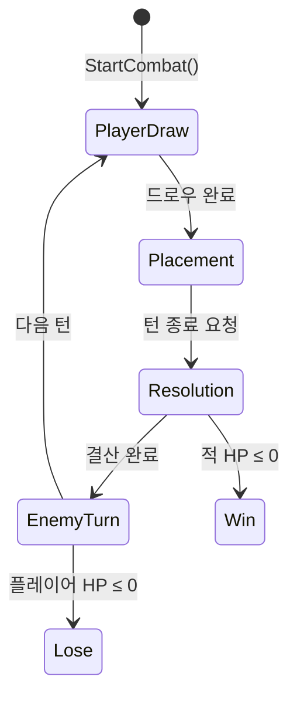

# 🏗️ Lead 개발자 구현 결과 — Core System & Combat Flow

## 프로젝트 구조

```
Assets/Scripts/
├── Core/
│   ├── Enums/
│   │   ├── SymbolType.cs      ← 블록 문양 열거형
│   │   ├── CardType.cs        ← 카드 효과 유형 (Attack/Defense)
│   │   └── CombatState.cs     ← 전투 상태 기계 상태 목록
│   └── Events/
│       └── GameEvents.cs      ← 글로벌 이벤트 버스
├── Data/
│   ├── BlockData.cs           ← 블록 형태/문양 ScriptableObject
│   └── CardData.cs            ← 카드 전투 속성 ScriptableObject
└── Combat/
    ├── CombatManager.cs       ← 턴 상태 기계 (핵심)
    ├── CombatUnit.cs          ← HP/방어도 런타임 관리
    ├── DeckManager.cs         ← 덱/핸드/무덤 관리
    └── CombatBootstrap.cs     ← 씬 진입점
```

## 아키텍처 설계 핵심

### 1. 이벤트 기반 Decoupling


> [!IMPORTANT]
> **모든 모듈 간 통신은 `GameEvents` 이벤트 버스를 통해서만 이루어집니다.**
> Dev A, Dev B는 `GameEvents`를 구독/발행하기만 하면 되며, Lead 코드를 직접 참조할 필요가 없습니다.

### 2. 턴 상태 기계 흐름


### 3. 데이터 주도 설계 (ScriptableObject)

| SO | 역할 | Inspector 편집 |
|---|---|---|
| `BlockData` | 블록 형태 (Width×Height) + 문양 배열 | ✅ 크기 변경 시 배열 자동 조정 |
| `CardData` | 카드명, 설명, 블록 참조, 타입, 기본 위력 | ✅ 블록과 전투 속성 조합 |

## Dev A / Dev B 를 위한 인터페이스 가이드

### Dev A (Grid & Puzzle Logic) 가 구현해야 할 것

1. **구독할 이벤트:**
   - `GameEvents.OnBlockPlaced` — 블록 배치 시 그리드 상태 업데이트
   - `GameEvents.OnResolutionPhaseStarted` — 결산 시작 → 겹침 계산 실행

2. **발행할 이벤트:**
   - `GameEvents.RaiseResolutionResult(totalDamage, totalDefense)` — 겹침 배수 적용된 최종 결과

### Dev B (UI/UX) 가 구현해야 할 것

1. **구독할 이벤트:**
   - `GameEvents.OnCardDrawn` — 핸드 UI에 카드 추가
   - `GameEvents.OnPlayerHpChanged` / `OnEnemyHpChanged` — HP바 갱신
   - `GameEvents.OnCombatStateChanged` — 상태별 UI 전환
   - `GameEvents.OnDamageDealtToEnemy` / `OnDamageDealtToPlayer` — 데미지 연출

2. **발행할 이벤트:**
   - `GameEvents.RaiseTurnEndRequested()` — 턴 종료 버튼 클릭 시
   - `GameEvents.RaiseBlockPlaced(card, x, y)` — 드래그&드롭으로 블록 배치 시
